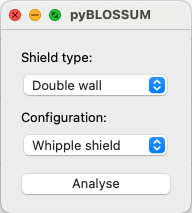

# pyBLOSSUM - a tool for assessing the Ballistic Limit Of Spacecraft Structures Under Micrometeoroid and orbital debris impact

This repository provides ballistic limit equations (BLEs) for calculating the performance of spacecraft structures under impact by micrometeoroid and orbital debris (MMOD) particles at hypervelocity.

## Getting started
To download this Git project open a terminal/command prompt and enter:
```
git clone https://github.com/shannonjryan/pyBLOSSUM.git
```
If you already have a previous version of the project you can simply update by navigating to the location of the repository and running:
```
git pull
```
## Setup
Requirements:
- Anaconda (https://www.anaconda.com/download)
- Python 3.12
	
The pre-requisite python packages are included in the 'environment.yml' file. To create an Anaconda environment based on the yml file open a terminal session and browse to the directory in which you cloned this repository. Run the following command:
```
conda env create --file environment.yml
```

## Comparing experimental data and BLE predictions
Experimental datasets are provided in the 'data' directory for the following shielding configurations:
* Whipple shields
* Stuffed Whipple shields
* Honeycomb core sandwich panels
* Foam core sandwich panels

Test results from those datasets can be plotted together with the ballistic limit curves. For example, if you define a Whipple shield configuration that is nominally identical (or very similar) to one in the experimental dataset, then the corresponding experiments can be included in your generated ballistic limit curve. 

## Running pyBLOSSUM
pyBLOSSUM can be run either as a GUI or from the command line/terminal. Depending on how you intend to run the code, the process will vary.

### Running via the GUI
Activate the python enviroment by running:
```
conda activate pyBLOSSUM
```

To launch the GUI navigate to the pyBLOSSUM installation directory and run:
```
python pyBLOSSUM.py
```
This will launch the GUI, as seen below.



### Running via command line
Activate the python enviroment by running:
```
conda activate pyBLOSSUM
```
A specific BLE can be called directly from the command line. Navigate to the pyBLOSSUM installation directory and run:
```
python BLEs\<BLE_filename> <input_filename> 
```
where <BLE_filename> should be replaced by the name of the BLE python file you want to call and <input_filename> should be replaced by the name of a csv file that defines your target configuration. 

<em>NOTE: for mac and unix-based systems replace "\\" with "/" in all path definitions.</em>

For example,
```
python BLEs\BLE_foamSP.py input_files\eval_example-foamSP.csv
```
will perform an evaluation on the foam sandwich panel defined in the 'eval_example-foamSP.csv' input file using the foam sandwich panel BLE. Example input files for each target configuration are provided in the 'input_files' directory. The fields (i.e., column headers) in these input files are needed for the BLE analysis, so should not be changed.

To include experimental data in the generated plots, include the flag --data, e.g.,
```
python BLEs\BLE_foamSP.py input_files\eval_example-foamSP.csv --data
```

## Output
Irrespective of how pyBLOSSUM is run, the output is the same, consisting of three files saved to the 'results' directory:
1. A png-format ballistic limit plot with the filename *plot_<date_time>.png*
2. A csv-format datafile containing the data plotted in the ballistic limit curve with the filename *blc_data_<date_time>.csv*
3. A csv-format datafile containing the inputs used to generate the ballistic limit curve with the filename *config_data_<date_time>.csv*.

The <date_time> is a date-time string is used to identify related plots, plot data, and configuration data files.


## License
This project is licensed under the MIT License - see [LICENSE.md](LICENSE.md) for details.


